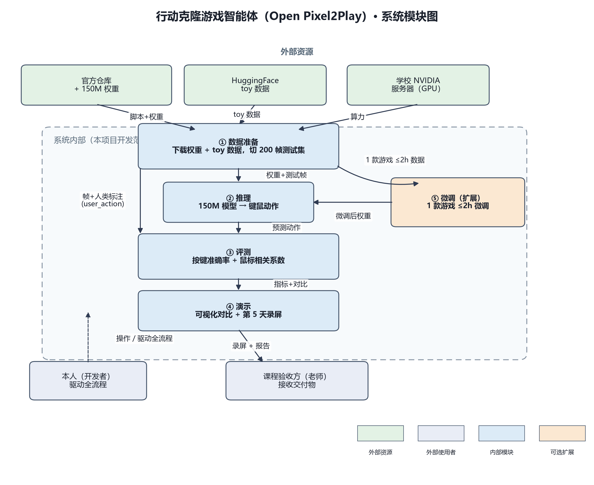

# 实践报告02 · 课题六：行为克隆游戏智能体（第 2 天）

## 基本信息

- 课题编号与名称：课题六 —— 行为克隆游戏智能体（腾讯 IEG 课题）
- 成员：陶子萱（独立完成）

## 今日目标

把第 1 天定下的主路径（跑通 150M 推理 → 200 帧评测 → 录屏演示）拆成可分工、可验收的组成部分，逐条对应第 1 天的必做；并为模型版本、推理环境、评测实现、推理硬件、数据下载五个技术点做出有依据的选择，作为第 3 天起工程实现的依据。

## 组成部分

按“数据准备 → 推理 → 评测 → 演示”的流水线划分，外加可选微调分支。独立完成，各模块的“谁负责”均为本人。

### 模块职责表

| 模块 | 职责 | 输入 | 输出 | 依赖谁 | 谁负责 |
|---|---|---|---|---|---|
| ① 数据准备 | 下载 150M 权重与 toy 样例数据，解析人类标注，切 200 帧测试集 | 官方下载脚本、toy 样例数据 | 权重、200 帧测试集（帧 + 人类标注） | 外部：官方仓库 / 学校服务器 | 本人 |
| ② 推理 | 加载 150M 模型，对帧输出键鼠动作 | ① 的权重 + 测试帧 | 每帧的键鼠动作 | ① 数据准备 | 本人 |
| ③ 评测 | 对比预测动作与人类标注，算两个指标 | ② 的预测 + ① 的人类标注 | 按键准确率、鼠标相关系数 | ① 数据准备、② 推理 | 本人 |
| ④ 演示 | 可视化“模型输出 vs 人类标注” + 第 5 天录屏 | ② 的预测、③ 的指标、① 的标注 | 对比图 + 录屏 | ①②③ | 本人 |
| ⑤ 微调（扩展） | 1 款游戏 2 小时数据微调，复测对比 | ① 的数据 + GPU | 微调后权重 + 指标对比（按键 +8pp 或 鼠标 +0.08） | ①、学校 GPU（回喂 ②） | 本人 |

### 系统模块图（外部使用者、内部模块与依赖方向）如下：

说明：必做 5“归档代码 + 指标表 + 报告”是本人跨模块收尾，不单列运行时模块。

## 与需求的对应

| 必做 / 主路径 | 负责模块 | 第 5 天是否演示 |
|---|---|---|
| 必做1： 跑通 150M 推理 | ② 推理 | 是 |
| 必做2： 编写评测脚本 | ③ 评测 | 是 |
| 必做3： 基线 ≥55% / ≥0.5 | ③ 评测 | 是 |
| 必做4： 第 5 天录屏 | ④ 演示 | 是 |
| 必做5： 归档代码 + 指标 + 报告 | 本人（跨模块） | 否（第 8~9 天） |
| 扩展·微调 | ⑤ 微调 | 否（视算力/数据来源） |

处理办法：① 数据准备不是“空模块”，它对应主路径第一步“获取仓库与 150M 权重”及必做 2 的“切 200 帧测试集”；必做 5 由本人跨模块承担，避免“无人承担的需求”。

## 技术选型

比较维度固定为：熟悉度、安装便利、与官方示例接近、一天内能否定位。本人技术基础为“接触过 Python、Git、Linux 命令行，未接触 GPU/深度学习”，故所有选型优先“与官方一致、易定位”，符合指导书“不因最新而选型”的原则。

| 选型点 | 入选 | 放弃 | 入选理由 / 放弃理由 |
|---|---|---|---|
| 模型版本 | 150M | 300M / 600M / 1200M | 官方入门默认、最快最省、9 天易跑通（大模型慢贵、基线用不上） |
| 推理环境 | uv + Python | pip / conda | 与官方 README 一致、可复现（pip 偏离官方、需自解依赖） |
| 评测实现 | 自研脚本 | 官方 validation.py | 官方 validation.py 只算困惑度（perplexity），不输出按键准确率 / 鼠标相关系数，故须自研评测脚本 |
| 推理硬件 | 学校 NVIDIA 服务器 | 本机 CPU | 本机无 N 卡仅集显，必须用服务器（CPU 无 GPU、仅兜底） |
| 数据下载 | 官方 download_data.py | 手动下载 | 官方封装好格式与切分、不易错（手动易漏、偏离官方） |

风险与对策：150M 基线可能达不到 55% / 0.5（核对口径、必要时换测试集，如实记录不虚构）；学校服务器可能排队 / 断网（提前申请、CPU 兜底）；权重与 toy 数据下载国内易超时（镜像 / 学术加速）；自研评测脚本指标口径可能出错（先小样本人工核对再全量）。

## 今日完成与自检

已确定：5 个组成部分及职责、需求-模块对应关系、5 个技术选型点（均含放弃理由）。自检：每条必做都有负责模块、无空模块、每个选型都有 ≥2 候选与放弃理由。

未定：① 微调“1 款游戏 2 小时数据”的来源，受指导书“不得下载 full-data 全库”约束，需问老师确认；② 200 帧测试集用 Toy 还是某款游戏，第 3 天定。

## 问题、计划与 AI 沟通

**不成功的沟通：**

- 首版架构图只有字符画，太草率、不可用。改为收窄范围重画：只保留“外部使用者 + 内部模块 + 依赖方向”三层，并用绘图工具重绘；重绘后图例仍越界，经逐项核对修正后才可用。
- 助手一度建议“从 full-data 下载 2 小时切片微调”，违反指导书“不得下载 full-data 全库”。本人对照指导书指出后，改为“微调数据来源待老师确认”。

**比较有效的沟通：**

- 先交代硬约束：“独立完成、9 天、一切以第 1 天必做 5 条为准、缺资料我会补、不要自己编”。这样助手给的是能逐条核对的内容，而不是大而全的空话。
- 每次要结果先给验收标准：如“每条必做要有负责模块”“每个选型要有放弃理由”“模块写清输入 / 输出 / 依赖谁”，逼它产出可验收的东西，避免只有空方块。

**明日安排：** 进入第 3 天“数据与约定”——下载 toy 数据、梳理 annotation.proto 字段与 200 帧测试集切分口径，并确认微调数据的合法来源。
