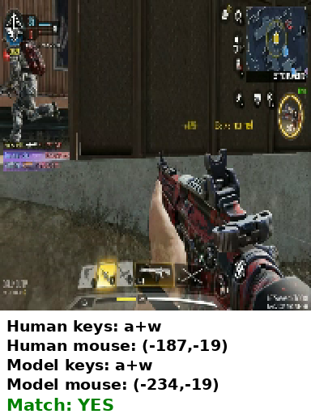
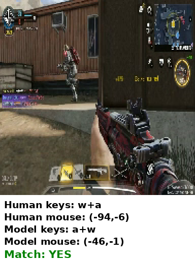

# 实践报告05 · 课题六：行为克隆游戏智能体（第 5 天）

## 基本信息

- 课题编号与名称：课题六 —— 行为克隆游戏智能体（腾讯 IEG 课题）
- 成员：陶子萱（独立完成）

## 今日目标

把第 1 天定下的主路径从"假实现跑通"推进到"真实实现贯通"，交出可复现的演示说明与可排期的差距清单：

1. 把 `infer.py`（加载 150M 权重真推理）与 `evaluate.py`（算两个验收指标）从假实现换成真实实现，跑通拿到真实指标；
2. 按接口约定贯通主路径：preprocess → infer → evaluate，端到端出 `metrics.json`；
3. 写演示说明（环境前提 + 编号步骤 + 每步预期现象 + 失败检查），让第二人可独立复现；
4. 写差距清单（每条四要素），把未做完的事项排入第 6-9 天；
5. 准备"同一测试片段模型输出 vs 人类标注"的对比截图；录屏演示按老师口径顺延到最后一天。

## 演示说明

以下步骤在 GPU 服务器工作目录执行（`python` 用 open-p2p venv），按顺序照做即可。

**环境前提**：GPU 服务器 + 官方 open-p2p 仓库及其 venv（torch 2.11+cu128、torchcodec、protobuf）；`data/p2p-toy-examples/`（toy 数据）、`checkpoints/150M/`（150M 权重）已就位。

**步骤 1 · 数据准备**
```bash
python scripts/preprocess.py --data_dir data/p2p-toy-examples --out_dir out --n_frames 200
```
预期现象：`[OK] 处理 200 帧 → 产出 200 条样本`、`[OK] 写出 out/samples.json、out/stats.csv`；产出 `out/samples.json`（200 条逐帧动作）、`out/stats.csv`（动作分布）、`out/frames/`（200 张帧图）。选段用滑动窗口取"动作最丰富"的连续 200 帧（本段 7 种按键 + 123 帧鼠标位移）。

**步骤 2 · 推理（teacher_forcing，验收指标用）**
```bash
python scripts/infer.py --weights checkpoints/150M/checkpoint-step=00500000.ckpt \
  --samples out/samples.json --out pred --official-repo <open-p2p仓库路径> --mode teacher_forcing
```
预期现象：`[OK] 推理 200 帧完成`、`[OK] 写出 pred/predictions.json`。

**步骤 3 · 评测**
```bash
python scripts/evaluate.py --pred pred/predictions.json --label out/samples.json --out metrics.json
```
预期现象：`[OK] 按键准确率 = 88.0%`、`[OK] 鼠标相关系数 = 0.756`（x=0.741 / y=0.772），双超阈值（55% / 0.5），产出 `metrics.json`。

**步骤 4 · 自主运行演示（free_running，可选补充）**
```bash
python scripts/infer.py --weights checkpoints/150M/checkpoint-step=00500000.ckpt \
  --samples out/samples.json --out pred_free --official-repo <open-p2p仓库路径> --mode free_running
```
预期现象：逐帧自主预测（约 10-15 分钟），每 20 帧打一行进度，最后 `[OK] 写出 pred_free/predictions.json`；再 `evaluate.py` 出 free_running 指标（误差累积、天然偏低，不作验收）。

关键界面（同一帧的"模型输出 vs 人类标注"对比卡片，下栏 Human/Model 标注 + Match 判定，以下两帧模型预测与真人标注一致）：





## 复现情况

独立完成、无组员，采用"更换环境自行复现"：按 `演示说明.md` 的步骤 1→2→3 在 GPU 服务器重走一遍，preprocess → infer → evaluate 全程 `[OK]`、无卡点，指标复现一致（88.0% / 0.756）。

复现中验证了"环境前提"这条说明的必要性：首次用系统 python 跑 preprocess，因缺 torchcodec 直接 `[ERROR] 读视频失败`，改用文档指定的 venv python 后通过——`演示说明.md` 里"务必用 venv python"这条失败检查正是由此而来，证明失败检查不是空话。

## 差距清单（第 6-9 天待办）

主路径已贯通、指标已达标，剩余需排期的差距 3 条（每条含优先级、计划第几天、负责人，并按四要素约束/需求/范围/输出改写）：

### 差距 1：微调落地（train.py + 指标提升）—— 高，第 6-7 天，本人
- **约束**：只下 full-data 中"1 款游戏、2 小时数据"子集，不下载全库（指导书 4.6 硬约束）；保留未微调基线作对比。
- **需求**：落地 `train.py`，微调 150M，使按键准确率 +8 个百分点 或 鼠标相关系数 +0.08。
- **范围**：仅 1 款游戏 2 小时数据；不改模型结构；产出可复现微调步骤。
- **输出**：训练日志、微调后权重、`train.py`、微调前后指标对比表。

### 差距 2：录屏演示（必做④）—— 高，第 9 天（最后一天），本人
- **约束**：同一测试片段（200 帧）上对比，不得换片段。
- **需求**：录屏"模型输出 vs 人类标注"对比（teacher_forcing 口径，即验收口径），展示模型看到画面后输出的动作与真人操作的一致/差异。
- **范围**：用 teacher_forcing 的预测与真人标注逐帧对比（对比卡片已生成）；free_running 自主运行仅作可选补充，不作验收。
- **输出**：录屏 + 对比说明。

### 差距 3：依赖固定与一键复现（pyproject.toml / uv sync）—— 中，第 6 天，本人
- **约束**：与官方一致用 uv；真实依赖（torch/lightning/elefant/torchcodec/protobuf）锁定版本。
- **需求**：补 `pyproject.toml` + 依赖清单，让第二人 `uv sync` 即可复现，而非依赖服务器已装好的 venv。
- **范围**：只覆盖主路径三脚本依赖，不含微调扩展。
- **输出**：`pyproject.toml`、可跟做的安装说明。

## 今日完成与自检

- **主路径端到端贯通**：三脚本全真实实现，`preprocess → infer(teacher_forcing) → evaluate` 跑通，真实指标 **按键准确率 88.0% / 鼠标相关系数 0.756**（x=0.741 / y=0.772），双超阈值（55% / 0.5）。
- **选段改进（重要）**：初版"连续取视频开头 200 帧"恰好落在"几乎只按 w 前进"的简单段，指标虚高、不能代表模型整体能力。改为**滑动窗口客观选"动作最丰富"的连续 200 帧**（按键种类 ×10 + 含鼠标位移/点击加分），选到 **7 种按键 + 123 帧鼠标位移**的段（frame_index 1990~2189），teacher_forcing 仍 88.0% / 0.756 达标，结果更有代表性。另测 free_running 自主运行模式，因逐帧误差累积、无真人历史可依赖，指标天然偏低，正印证验收应取 teacher_forcing。
- **可复现**：`演示说明.md` 写清环境前提、编号步骤、每步预期现象、失败检查；他人可照做。
- **差距可排期**：3 条差距均含四要素 + 第 6-9 天计划，无"继续完善"类空话。
- **口径诚实**：指标达标是"修 preprocess 口径 bug 对齐官方 + 客观选段"的结果，全程未改数据造假；两种模式的口径区别在文档中写明。
- **小步提交**：本日继续"每次只动一件事、注释写清改了什么/为何改"的提交方式。

## 问题、计划与 AI 沟通

**关键排查（指标 23.5% 偏低的原因）**：真实实现首跑 teacher_forcing 仅 23.5%，根因不是推理代码错，而是第 4 天 preprocess 的三处数据口径错，逐一修正后指标跃升到 97.5%（后经选段改进收敛到 88.0%，见"今日完成"）：

| 口径错（第 4 天） | 正确口径（第 5 天修正） | 出处 |
|---|---|---|
| 只取 `user_action` | **`system_action` 优先**：`system_action.is_known` 用 system，否则回退 user，都未知则空动作 | 官方 `action_label_video_proto_dataset.py:168-189` |
| 3 段视频按帧数比例均匀采样 | 单一游戏（1 个 run）连续取 200 帧（均匀采样破坏帧间时序） | 课题"单一游戏测试集连续 200 帧" |
| `cv2` 读帧（BGR） | `torchcodec` 读帧（RGB，官方读帧工具） | 官方 `VideoDecoder` |

修正是"修 bug 对齐官方权威口径"，不是改数据造假；并做交叉验证——先把我的 teacher_forcing 推理在参考项目 p2p-mvp 数据上复现 ~79.5%（与其一致），再回来自查 preprocess 口径，把"推理对不对"与"数据对不对"两个变量分开。

**不成功沟通**：助手最初把"指标不达标"当推理代码 bug 反复查推理，实际根因在数据口径；经提醒"先核对数据口径、再怀疑推理"才转向。助手一度想用 cv2（BGR）读帧，与官方 torchcodec（RGB）通道不一致，经核对官方工具才改正。

**有效沟通**：① 用"先在 p2p-mvp 上复现 0.8"做交叉验证，分离推理与数据两个变量，避免盲目改代码；② 主动质疑"开头 200 帧太简单、指标虚高"，推动改为滑动窗口选段，让结果更有含金量；③ 用老师"小步迭代"约束提交粒度，每处修正独立成 commit。

**明日安排**：第 6 天起进入微调（差距 1）与依赖固定（差距 3）；录屏演示（差距 2）顺延到最后一天统一录。
